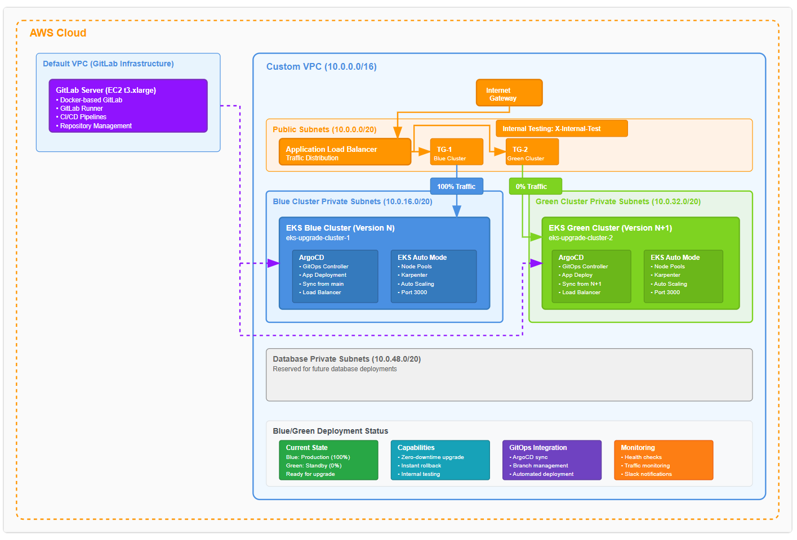

# EKS Blue/Green Upgrade Automation

## Table of Contents
- [Overview](#overview)
- [Architecture](#architecture)
- [Prerequisites](#prerequisites)
- [Getting Started](#getting-started)
- [Deployment Modes](#deployment-modes)
  - [Manual Mode (CI=false)](#manual-mode-cifalse)
  - [Automated Mode (CI=true)](#automated-mode-citrue)
- [Setup Process](#setup-process)
  - [1. Environment Configuration](#1-environment-configuration)
  - [2. GitLab Infrastructure Setup](#2-gitlab-infrastructure-setup)
  - [3. Blue/Green Deployment Workflow](#3-bluegreen-deployment-workflow)
- [Workflow Scripts](#workflow-scripts)
- [Examples and Demo](#examples-and-demo)
- [Troubleshooting](#troubleshooting)
- [Cleanup](#cleanup)
- [Security Considerations](#security-considerations)
- [Contributing](#contributing)
- [License and Disclaimer](#license-and-disclaimer)

---

## Overview

Amazon EKS Blue/Green Upgrade Automation provides a comprehensive solution for implementing zero-downtime upgrades for critical Kubernetes workloads. This workshop demonstrates a deployment strategy that ensure:

✨ **Zero-Downtime Upgrades**
- Seamless cluster version upgrades without service interruption
- Traffic switching between blue and green clusters
- Rollback capabilities for quick recovery

✨ **Automation**
- GitLab CI/CD pipeline orchestration
- Infrastructure as Code with Terraform
- GitOps workflow with ArgoCD integration

✨ **Enterprise Features**
- Internal testing capabilities before full promotion
- Automated load balancer configuration
- Comprehensive monitoring and validation

✨ **Flexible Deployment Options**
- Manual mode for learning and debugging
- Automated CI/CD mode for production deployments
- Step-by-step workflow for understanding the process

This repository provides educational value for learning blue/green deployment patterns and an automated upgrade setup for enterprise Kubernetes environments to build on.

---

## Architecture

The blue/green deployment strategy uses two identical production environments:

```
┌─────────────────┐    ┌─────────────────┐
│   Blue Cluster  │    │  Green Cluster  │
│   (Version N)   │    │  (Version N+1)  │
│                 │    │                 │
│  ┌───────────┐  │    │  ┌───────────┐  │
│  │   ArgoCD  │  │    │  │   ArgoCD  │  │
│  │ (main br) │  │    │  │ (N+1 br)  │  │
│  └───────────┘  │    │  └───────────┘  │
└─────────────────┘    └─────────────────┘
         │                       │
         └───────────┬───────────┘
                     │
            ┌─────────────────┐
            │  Application    │
            │  Load Balancer  │
            │                 │
            │ Traffic Weight  │
            │ Blue: 100%      │
            │ Green: 0%       │
            └─────────────────┘
```



**Network Configuration:**
- Public Subnets: `10.0.0.0/20`
- Blue Cluster Private Subnets: `10.0.16.0/20`
- Green Cluster Private Subnets: `10.0.32.0/20`
- Database Private Subnets: `10.0.48.0/20`

**Key Components:**
- **Application Load Balancer (ALB)**: Routes traffic between clusters
- **Target Groups**: Separate groups for blue and green clusters
- **ArgoCD**: GitOps deployment automation
- **GitLab CI/CD**: Pipeline orchestration and automation

---

## Prerequisites

### Required Tools
Ensure you have the following tools installed:

- [AWS CLI](https://docs.aws.amazon.com/cli/latest/userguide/getting-started-install.html) (v2.0+)
- [Terraform](https://www.terraform.io/downloads) (v1.0+)
- [kubectl](https://kubernetes.io/docs/tasks/tools) (compatible with your EKS version)
- [Node.js](https://nodejs.org/en/download) (v18+)

### AWS Requirements
- AWS CLI configured with appropriate credentials
- IAM permissions for:
  - EKS cluster creation and management
  - EC2 instance management
  - VPC and networking resources
  - Application Load Balancer management

---

## Getting Started

1. **Clone the Repository**:
```bash
git clone https://github.com/aws-samples/eks-blue-green-upgrade-automation.git # Replace this with actual repo
cd eks-blue-green-upgrade-automation                                           # Replace this with actual repo
```

2. **Install Dependencies**:
```bash
# Install Node.js dependencies
npm install

# Install zx for script execution
npm install -g zx
```
---

## Deployment Modes

### Manual Mode (CI=false)

**Best for:**
- Learning and understanding the workflow
- Development and testing environments
- Step-by-step debugging and validation
- Educational workshops and demonstrations

**Characteristics:**
- All scripts run locally on your machine
- Manual execution of each deployment step
- Full visibility into each operation
- Easy troubleshooting and customization

### Automated Mode (CI=true)

**Best for:**
- Production deployments
- Repeatable and consistent operations
- Enterprise CI/CD integration
- Reduced human error and operational overhead

**Characteristics:**
- GitLab CI/CD pipelines orchestrate deployment
- Only bootstrap scripts run locally
- Automated validation and rollback capabilities
- Audit trail and deployment history

---

## Setup Process

### 1. Environment Configuration

Configure your environment by creating a `.env.local` file with your specific values:

```bash
# Get your AWS Account ID
ACCOUNT_ID=$(aws sts get-caller-identity --query Account --output text)

# Create your local environment configuration
cat > .env.local << EOF
ENVIRONMENT_NAME=your-environment-name
KUBERNETES_VERSION=1.30 # can change this to whatever version you wish to start from
REGION=your-aws-region
ACCOUNT_ID=$ACCOUNT_ID
EKS_ADMIN_ROLE=your-admin-role-name
CI=false  # Set to 'true' for automated mode
SLACK_CHANNEL="#your-slack-channel"  # can leave the slack variables empty if no slack integration
SLACK_BOT_TOKEN=your-slack-bot-token
EOF
```

**Required Configuration Values:**
- `ENVIRONMENT_NAME`: Unique name for your deployment environment
- `KUBERNETES_VERSION`: Target EKS version for green cluster (1.30 or higher)
- `REGION`: AWS region for deployment (e.g., us-west-2, eu-west-1)
- `ACCOUNT_ID`: Your AWS Account ID (auto-populated above)
- `EKS_ADMIN_ROLE`: IAM role name for cluster administration
- `CI`: Toggle between manual (`false`) and automated (`true`) modes
- `SLACK_CHANNEL`: Optional Slack channel for notifications
- `SLACK_BOT_TOKEN`: Optional Slack bot token for notifications

> **Note**: The `.env.local` file will override default values in `.env` and should contain your specific configuration. This file is typically excluded from version control.

### 2. GitLab Infrastructure Setup

Set up the GitLab environment for CI/CD operations:

```bash
# Make scripts executable
chmod +x scripts/*.mjs
chmod +x scripts/utils/*.mjs

# Initialize the environment
./setup.mjs

# Deploy GitLab infrastructure
./1-setup-gitlab.mjs
```

This will:
- Deploy GitLab on an EC2 instance
- Configure GitLab projects and repositories
- Set up CI/CD variables and runners (if CI=true)
- Generate access credentials

### 3. Blue/Green Deployment Workflow

#### For Manual Mode (CI=false):

Execute the complete workflow step by step:

```bash
# 1. Create base infrastructure
./2-create-base-infra.mjs

# 2. Deploy blue cluster with ArgoCD
./3-create-blue-cluster.mjs

# 3. Prepare for green cluster deployment
./4-setup-next-version-branch.mjs

# 4. Deploy green cluster
./5-create-green-cluster.mjs

# 5. Enable internal testing
./6-enable-internal-test.mjs

# 6. Promote green cluster to production
./7-promote-green-cluster.mjs

# Optional: Rollback if needed
./8-rollback-blue-cluster.mjs

# 7. Merge version branches
./9-merge-next-version-branch.mjs

# 8. Clean up old cluster
./10-delete-green-cluster.mjs
```

#### For Automated Mode (CI=true):

After GitLab setup, use the GitLab web interface to trigger pipeline stages:

1. Navigate to your GitLab instance
2. Access the project pipeline section
3. Trigger each stage manually or configure automatic triggers
4. Monitor progress through GitLab CI/CD interface

---

## Workflow Scripts

### Core Infrastructure Scripts

| Script | Purpose | Components |
|--------|---------|------------|
| `1-setup-gitlab.mjs` | GitLab Infrastructure | EC2, Docker, GitLab Runner, CI/CD Variables |
| `2-create-base-infra.mjs` | Base Infrastructure | VPC, ALB, Target Groups, Networking |

### Blue Cluster Deployment

| Script | Purpose | Components |
|--------|---------|------------|
| `3-create-blue-cluster.mjs` | Blue Cluster Setup | EKS Cluster, Node Groups, ArgoCD, Core Add-ons |

### Green Cluster Deployment

| Script | Purpose | Components |
|--------|---------|------------|
| `4-setup-next-version-branch.mjs` | Version Branch Setup | Git Branch Creation, Repository Preparation |
| `5-create-green-cluster.mjs` | Green Cluster Setup | EKS Cluster (N+1), ArgoCD Configuration |

### Traffic Management

| Script | Purpose | Components |
|--------|---------|------------|
| `6-enable-internal-test.mjs` | Internal Testing | ALB Rules, Header-based Routing |
| `7-promote-green-cluster.mjs` | Production Promotion | Traffic Weight Adjustment, Cluster Role Swap |
| `8-rollback-blue-cluster.mjs` | Rollback Capability | Traffic Reversion, State Management |

### Cleanup and Maintenance

| Script | Purpose | Components |
|--------|---------|------------|
| `9-merge-next-version-branch.mjs` | GitOps Management | Branch Merging, Version Tagging |
| `10-delete-green-cluster.mjs` | Resource Cleanup | Cluster Deletion, State Cleanup |
| `cleanup-everything.mjs` | Complete Cleanup | All Workload Resources |
| `cleanup-gitlab.mjs` | GitLab Cleanup | GitLab Infrastructure |

---

## Examples and Demo

### Basic Blue/Green Deployment

The workshop includes a sample application (nginxdemos/nginx-hello) that demonstrates:

1. **Initial Blue Deployment**: Application running on cluster version N
2. **Green Cluster Creation**: New cluster with version N+1
3. **Internal Testing**: Validate green cluster with test traffic
4. **Traffic Switching**: Gradual or immediate traffic migration
5. **Rollback Testing**: Quick reversion to blue cluster if needed
---

## Cleanup

### Partial Cleanup (Keep GitLab)

Remove workload infrastructure while preserving GitLab for future deployments:

```bash
./cleanup-everything.mjs
```

This removes:
- Both blue and green EKS clusters
- Application Load Balancer and target groups
- VPC and networking resources
- Cluster state files

### Complete Cleanup

Remove all infrastructure including GitLab:

```bash
# Clean up workloads first
./cleanup-everything.mjs

# Then remove GitLab infrastructure
./cleanup-gitlab.mjs
```

> ⚠️ **Warning**: Complete cleanup will destroy all resources. Ensure you have backups of any important data or configurations.

---

## Security Considerations

### ⚠️ GitLab Security Considerations

**IMPORTANT SECURITY WARNING**: The GitLab setup in this workshop is designed for demonstration and learning purposes only and includes several security configurations that are **NOT suitable for production environments**.

**Current GitLab Configuration:**
- **EC2 Instance**: Deployed in a public subnet with public IP address
- **GitLab Access**: Runs as a Docker container accessible via HTTP (port 80)
- **Security Groups**: Allow access from anywhere (`0.0.0.0/0`) on multiple ports:
  - Port 22 (SSH) - Open to the internet
  - Port 80 (HTTP) - Open to the internet  
  - Port 443 (HTTPS) - Open to the internet
  - Port 2222 (GitLab SSH) - Open to the internet
- **Authentication**: Uses hardcoded password (`eks12345`) for easy demonstration
- **Encryption**: HTTP traffic is unencrypted in transit

**Security Risks:**
- ❌ **Public Internet Exposure**: GitLab instance is directly accessible from the internet
- ❌ **Weak Authentication**: Hardcoded, well-known password
- ❌ **Unencrypted Traffic**: HTTP communication without TLS/SSL
- ❌ **Overly Permissive Access**: Security groups allow global access
- ❌ **No Network Segmentation**: No VPN or bastion host protection

**For Production Deployments, Implement:**
- ✅ **Private Subnets**: Deploy GitLab in private subnets behind NAT Gateway
- ✅ **VPN/Bastion Access**: Use VPN or bastion hosts for secure access
- ✅ **HTTPS/TLS**: Enable SSL certificates and force HTTPS
- ✅ **Strong Authentication**: Implement strong passwords, MFA, and LDAP/SSO
- ✅ **Restricted Security Groups**: Limit access to specific IP ranges/VPCs
- ✅ **Network Segmentation**: Use private networking with proper firewall rules
- ✅ **Regular Updates**: Keep GitLab and underlying OS updated
- ✅ **Backup Strategy**: Implement automated backups and disaster recovery
- ✅ **Monitoring**: Enable logging, monitoring, and alerting
- ✅ **Secrets Management**: Use AWS Secrets Manager or similar for credentials

---

## Contributing

We welcome contributions! Please read our [Contributing Guidelines](CONTRIBUTING.md) and [Code of Conduct](CODE_OF_CONDUCT.md) for more information.

---

## License and Disclaimer

### License
This project is licensed under the MIT License - see [LICENSE](LICENSE) file.

### Disclaimer
⚠️ **This repository is intended for demonstration and learning purposes only.**
It is **not** intended for production use. The code provided here is for educational purposes and should not be used in a live environment without proper testing, validation, and modifications.

Use at your own risk. The authors are not responsible for any issues, damages, or losses that may result from using this code in production.

Check [Security Considerations](SECURITY.md) for more information on the security scans.
